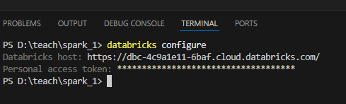

# Databricks CLI

## Installation

#### Install Databricks CLI on windows 

databricks cli [https://docs.databricks.com/aws/en/dev-tools/cli/install]

#### Configure

1. Generate access token from Settings/Developer
2. Write databricks host e.g. https://dbc-4c9a1e11-6baf.cloud.databricks.com/
3. Run command in command line (e.g. powershell, bash) 
```bash 
databricks configure
```
1. Fill the host and token in command line.



Above command generates .databrickscfg file. If you have one workspace there will be only [default] section.

## Most popular commands

```bash
databricks clusters list #Cluster management
databricks clusters start --cluster-id< cluster_id>
databricks secrets #Secrets api
databricks fs #Filesystem relates commands
databricks jobs
databricks jobs run-now --job-id 

